# m3u8DL Sniffer

浏览器视频嗅探插件（Chrome / Manifest V3），嗅探网页中的 m3u8、mp4、mpd 等媒体资源，一键发送到 N_m3u8DL-RE-WEB-UI 远程下载器。

## 功能特性

- **资源嗅探**：自动识别网页中的视频/音频请求，支持 m3u8、mp4、ts、m4s、mpd、flv、webm、mp3 等常见格式，可识别 `.txt`/`.json` 伪装的 m3u8
- **在线预览**：m3u8 资源可直接在弹窗中预览播放（hls.js），并显示清晰度、时长、分片数等信息
- **一键下载**：勾选资源后发送到远程服务器，由 N_m3u8DL-RE 完成实际下载与合并
- **代理支持**：预览和下载任务均可走 HTTP/HTTPS/SOCKS5 代理，支持快捷开关
- **AI 翻译**：支持使用 AI 翻译视频标题，方便外语内容管理
- **现代化界面**：统一的设计语言，自动跟随系统切换深色模式
- **可配置嗅探类型**：可在设置中勾选需要嗅探的资源类型

## 工作原理

扩展本身只负责「嗅探 + 转发链接」，不下载视频；实际下载由远程服务器完成。

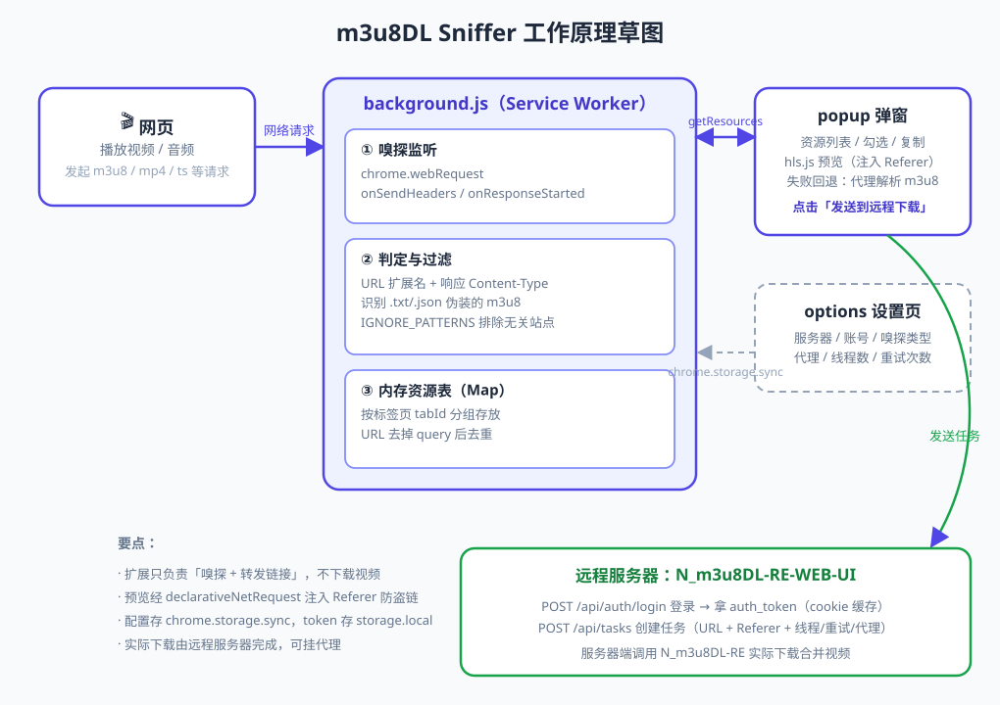

1. `background.js`（Service Worker）通过 `chrome.webRequest` 监听网络请求，按扩展名 + Content-Type 判定媒体资源，按标签页分组去重后暂存内存
2. 点击扩展图标，popup 拉取当前标签页的资源列表；预览时通过 `declarativeNetRequest` 注入 Referer 绕防盗链
3. 发送任务时先登录服务器获取 `auth_token`，再调用 `POST /api/tasks` 创建下载任务

## 完整部署教程

### 第一步：部署 N_m3u8DL-RE-WEB-UI 服务器

#### 1.1 创建目录

```bash
mkdir -p /data/m3u8dl
cd /data/m3u8dl
```

#### 1.2 创建 docker-compose.yml

```yaml
version: '3.8'

services:
  m3u8dl:
    image: htnaoao/m3u8dl-web-ui:latest
    container_name: m3u8dl-web-ui
    restart: unless-stopped
    ports:
      - "8080:8080"
    volumes:
      - ./data:/app/downloads
      - ./config:/app/config
    environment:
      - ALLOW_ORIGINS=*
      - USERNAME=admin
      - PASSWORD=your_password_here
```

> **说明**：
> - `8080:8080`：Web UI 端口
> - `./data:/app/downloads`：下载文件存储目录
> - `./config:/app/config`：配置文件目录
> - `ALLOW_ORIGINS=*`：允许浏览器扩展访问（重要！）
> - `USERNAME` 和 `PASSWORD`：登录账号密码

#### 1.3 启动服务

```bash
docker compose up -d
```

#### 1.4 验证服务

打开浏览器访问 `http://your-server-ip:8080`，使用配置的用户名密码登录。

### 第二步：安装浏览器插件

#### 2.1 下载插件

从 GitHub 下载最新版本：
```bash
git clone https://github.com/panoptes88/m3u8dl-browser-extension.git
```

或者下载 [Releases](https://github.com/panoptes88/m3u8dl-browser-extension/releases) 中的 zip 包。

#### 2.2 安装插件

1. 打开 Chrome，地址栏输入 `chrome://extensions/`
2. 开启右上角「开发者模式」
3. 点击「加载已解压的扩展程序」
4. 选择下载的插件目录

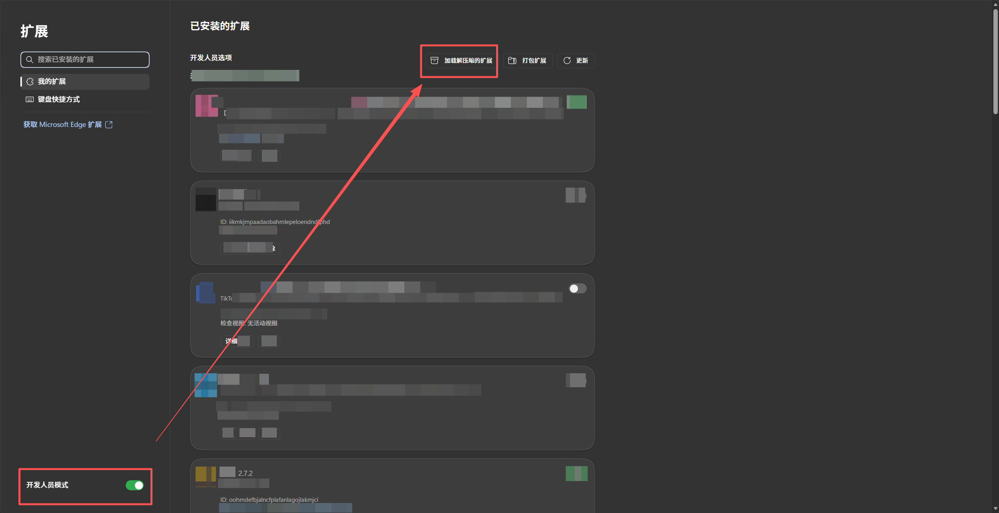

### 第三步：配置插件

#### 3.1 打开设置页面

右键扩展图标 → 选择「选项」

或者在扩展管理页面点击「详情」→「扩展程序选项」

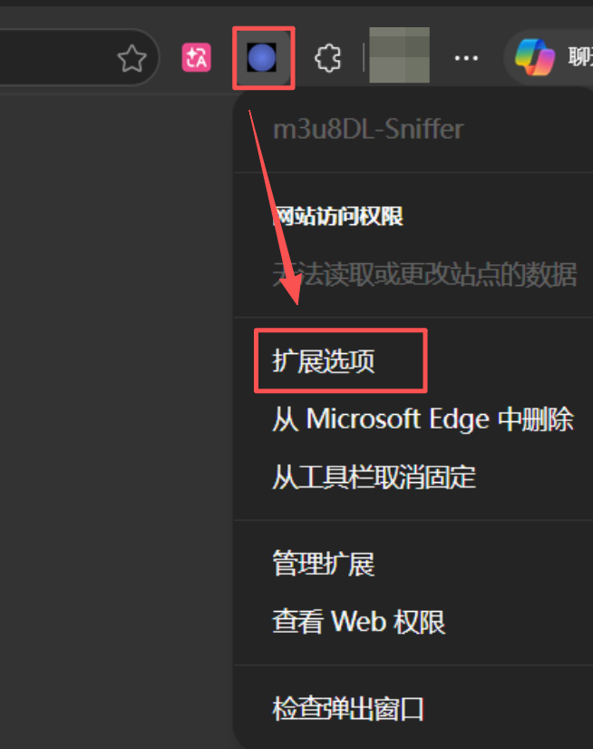

#### 3.2 配置服务器

在「远程服务器配置」中填写：
- **服务器地址**：`http://your-server-ip:8080`
- **用户名**：`admin`
- **密码**：`your_password_here`

点击「测试连接」验证配置是否正确。

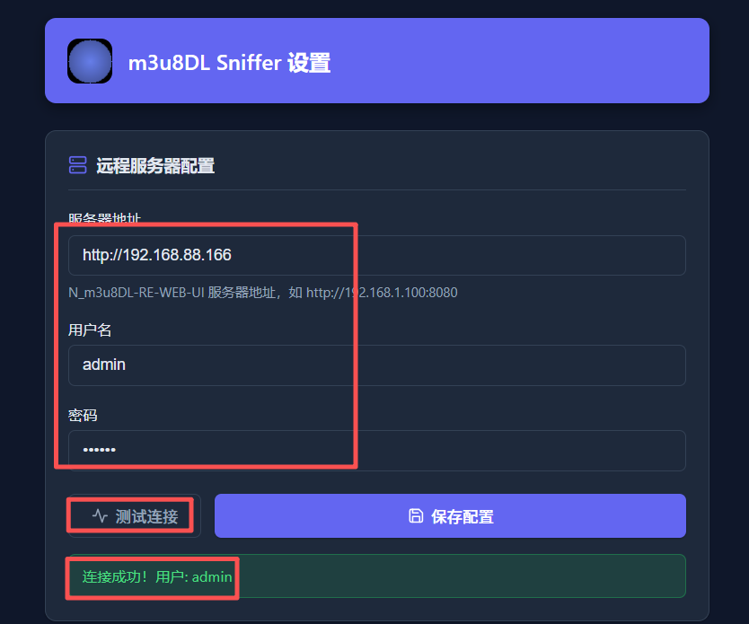

#### 3.3 配置代理（可选）

如果需要代理下载，在「代理配置」中：
1. 勾选「启用代理」
2. 填写代理类型、地址、端口
3. 如果需要认证，勾选「需要认证」并填写用户名密码

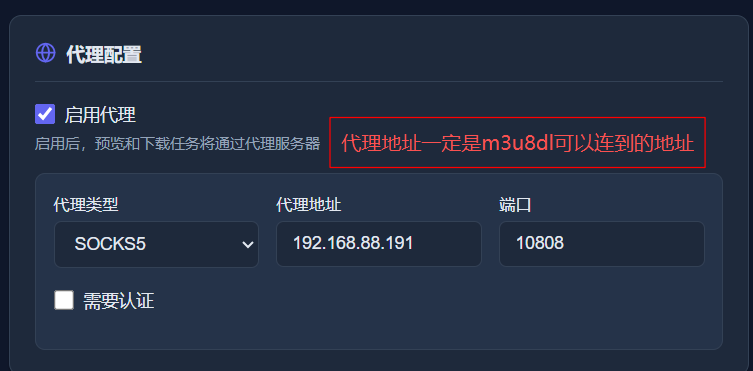

#### 3.4 配置 AI 翻译（可选）

如果需要翻译视频标题，在「AI 翻译配置」中：
1. 勾选「启用 AI 翻译」
2. 填写 API Base URL（如 `https://api.gpt.ge`）
3. 填写模型 ID（如 `gpt-4o-mini`）
4. 填写 API Key
5. 自定义翻译提示词（可选）

点击「测试翻译」验证配置是否正确。

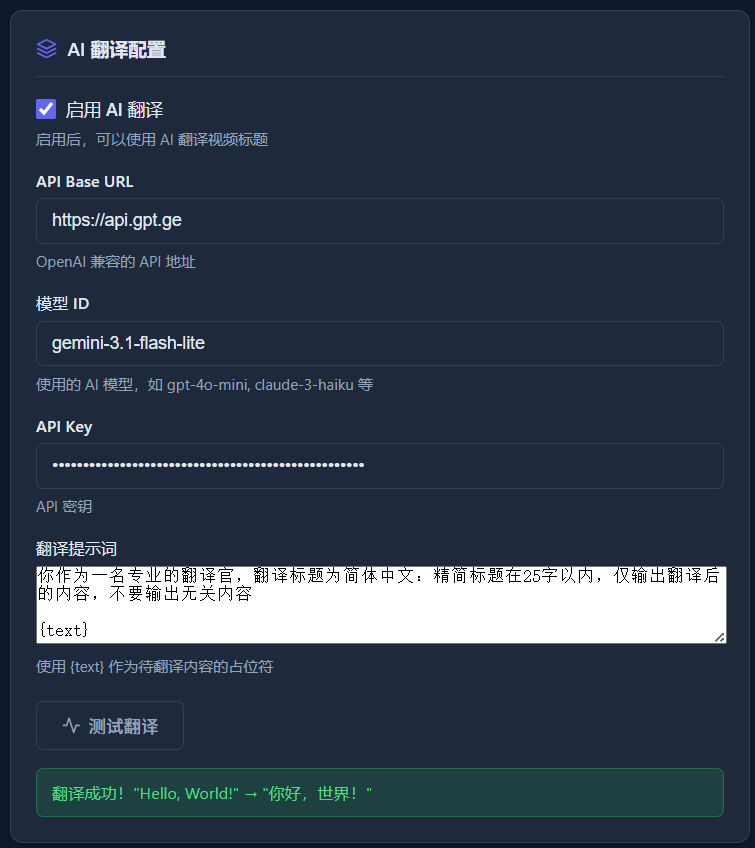

#### 3.5 保存配置

点击「保存配置」按钮。

### 第四步：使用插件

#### 4.1 嗅探视频

1. 打开包含视频的网页（如 B站、YouTube 等）
2. 播放视频（触发资源嗅探）
3. 点击扩展图标查看嗅探到的资源

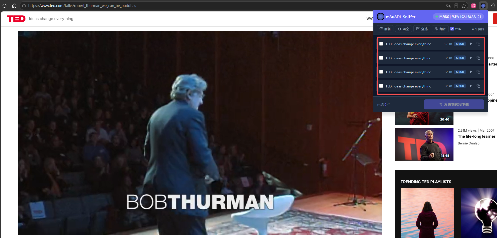

#### 4.2 预览视频

对于 m3u8 资源，可以点击 ▶ 按钮预览：
- 自动播放视频
- 显示清晰度、时长、分片数等信息

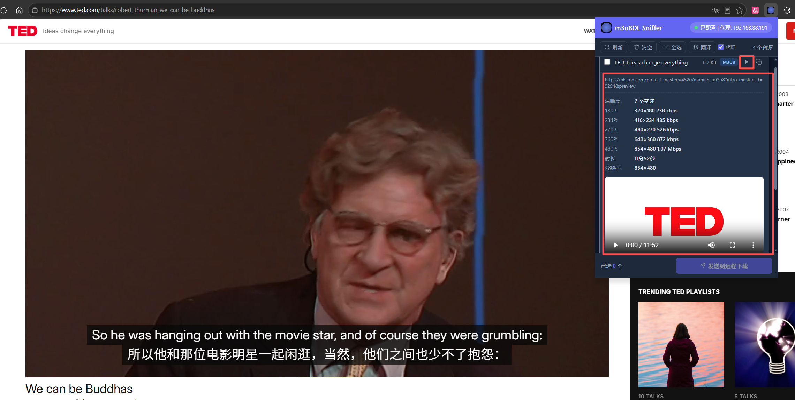

#### 4.3 翻译标题

如果配置了 AI 翻译：
1. 点击工具栏的「翻译」按钮
2. 等待翻译完成
3. 标题会自动翻译成中文

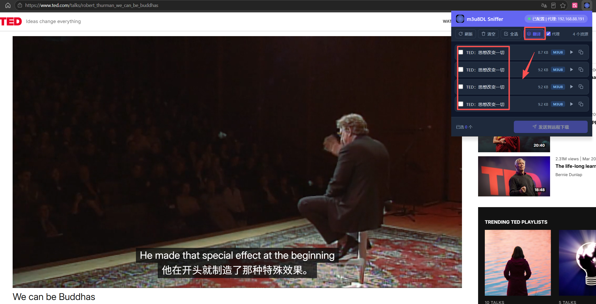

#### 4.4 下载视频

1. 勾选要下载的资源
2. 点击「发送到远程下载」
3. 等待任务发送成功

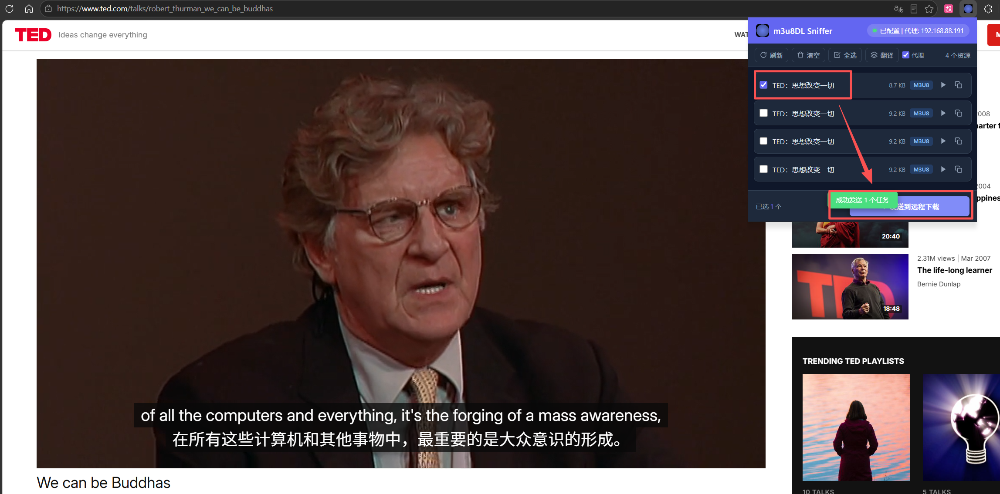

#### 4.5 管理代理

在 popup 窗口右上角可以快速切换代理开关：
- 勾选「代理」：下载时使用代理
- 取消勾选：下载时不使用代理

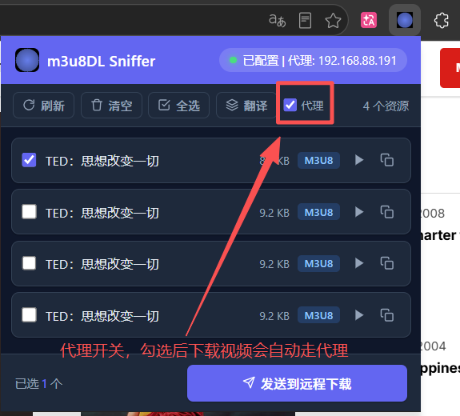

### 第五步：查看下载结果

#### 5.1 访问 Web UI

打开 `http://your-server-ip:8080`，查看下载任务列表。

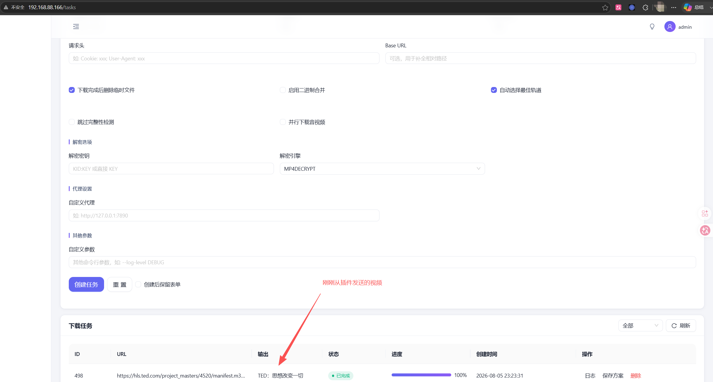

#### 5.2 查看下载文件

下载的文件保存在服务器的 `/data/m3u8dl/data` 目录中。

## 高级配置

### 嗅探资源类型

在设置页面的「嗅探资源类型」中，可以勾选需要嗅探的格式：
- 默认启用：m3u8、mp4、ts、m4s、m4a、mpd、flv、webm、mp3、wav、ogg、aac、mkv、mov、avi
- 取消勾选将不会嗅探该类型

### 下载参数

在「默认下载参数」中可以配置：
- **线程数**：默认 32，建议根据网络情况调整
- **重试次数**：默认 15，网络不稳定时可增加
- **自动选择最佳流**：默认启用，自动选择最佳视频和音频流

### 代理配置详解

支持三种代理类型：
- **HTTP**：最常用，兼容性好
- **HTTPS**：加密代理
- **SOCKS5**：支持更多协议

代理认证支持：
- 无认证
- 用户名/密码认证

## CORS 配置详解

浏览器扩展的请求来源是 `chrome-extension://...`，服务器默认的 CORS 配置不允许此类来源。

### 解决方法

在 `docker-compose.yml` 中添加环境变量：

```yaml
environment:
  - ALLOW_ORIGINS=*
```

然后重启容器：

```bash
cd /data/m3u8dl
docker compose down
docker compose up -d
```

> **注意**：`ALLOW_ORIGINS=*` 表示允许所有来源访问。如果担心安全问题，可以设置为具体的值，但需要包含扩展的 origin（格式为 `chrome-extension://扩展ID`）。

## 调试

如果遇到问题，可以查看扩展的 Service Worker 日志（日志统一带 `[m3u8DL]` 前缀）：

1. 访问 `chrome://extensions/`
2. 找到 m3u8DL Sniffer
3. 点击「Service Worker」链接
4. 在打开的 DevTools 中查看 Console 日志

### 常见问题

#### 1. 连接服务器失败
- 检查服务器地址是否正确
- 检查服务器是否启动
- 检查防火墙设置

#### 2. 资源不显示
- 确保视频正在播放
- 点击「刷新」按钮
- 检查嗅探类型是否启用

#### 3. 下载失败
- 检查代理配置
- 检查服务器日志
- 增加重试次数

#### 4. 翻译失败
- 检查 API 配置
- 检查 API Key 是否有效
- 查看控制台日志

## 更新日志

### v1.0.0
- 初始版本
- 支持资源嗅探、预览、下载
- 支持代理配置
- 支持 AI 翻译
- 支持快捷代理开关
